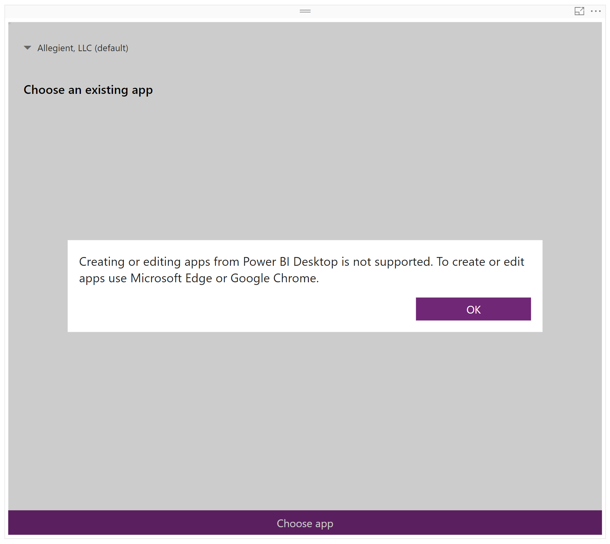
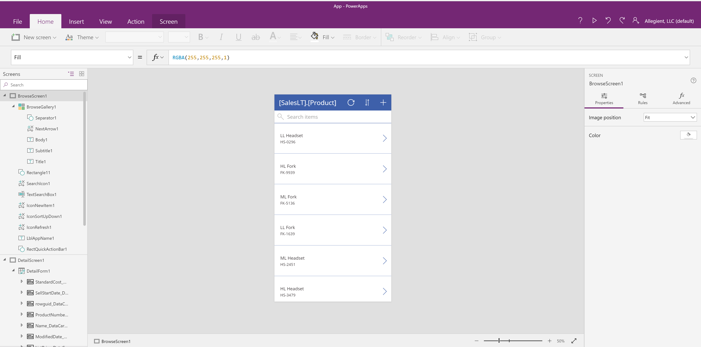

**Manipulating Data with PowerApps**
==

**Setup**
--

Getting set up to use the PowerApps custom visual is quite easy.

  1. Install the PowerApps visual, either through the [marketplace](https://appsource.microsoft.com/en-us/product/power-bi-visuals/WA104381378?tab=Overview), or by directly importing it through your Power BI environment.
    1. Go to the 'Import a custom visual'>'Import from the marketplace' menu under visualizations.
    2. Search for PowerApps, and click the 'Add' button.

You'll also need to have access to a dataset, either on-premises with a PowerApps gateway, or in an Azure instance. I will be using the default Adventure Works sample database on an Azure SQL Server instance. Make sure that it's available and imported to your Power BI environment before you get started.

**Your First App**
--
When you first put down a PowerApps visual in your report, it will look like the image below.

If you clear the pop up, you'll see a screen asking you to choose an existing app. If you already have your PowerApps app written, skip ahead to the section where we deal with setting it up in Power BI. If not, no worries! Now is when we are going to go over creating a simple app to do some source data manipulation.

If you are on the desktop client, follow the instructions in this section. If you are using the web client, skip to the web client section below.

To start with, you'll have to login to the [PowerApps site](create.powerapps.com). Once you are in, select the 'Start from Data' template. You'll see a variety of data source options, but for the purposes of this demo, we are going to use the SQL Server data source. Plug in your connection information, and you should see a list of tables once the connection is established.

For this demo, I'm going to select the SalesLT.Product table. Once you have selected your table, it will take a minute while PowerApps is putting the template together for you. Once that's done, you'll be dropped off in the online PowerApps IDE. It should look something like this.

You can demo the app with the play button in the upper right corner. If you poke around the app a little in demo mode, you can see that the stock app lets you modify the source data right away. Once you're done looking through the app, save it by going to 'File'>'Save'. With that complete, this is a great place to pause and see what it looks like to use your PowerApp through Power BI.

**Using Your App in Power BI**
--

Start by returning to your Power BI environment. Go to the PowerApps Visual you previously added to the report. At the bottom, click the button to 'Choose app' and then select your app from the list.

Once your app has loaded in, you should be able to use your app from within your report or dashboard. In the case of our app, we can modify the product data without having to open up SSMS to modify our source data. Something to note is that if you have other visuals based on the data being modified here, you won't see your changes reflected until you refresh your dataset, regardless of whether you are using a DirectQuery or Imported dataset.

**Congratulations! You've created your first PowerApps Visual.**
