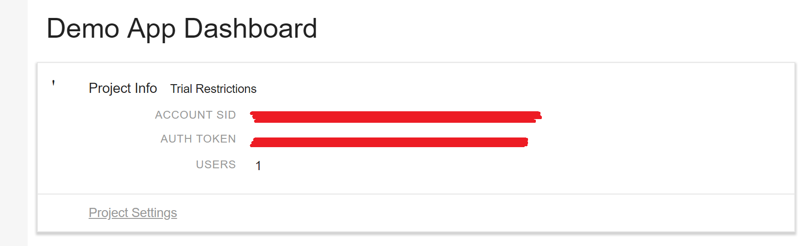
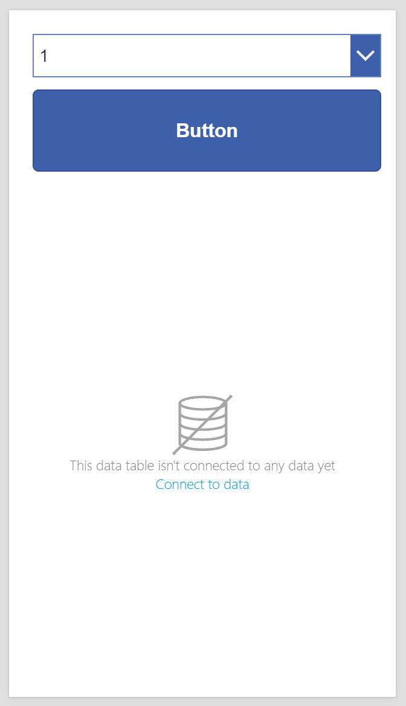
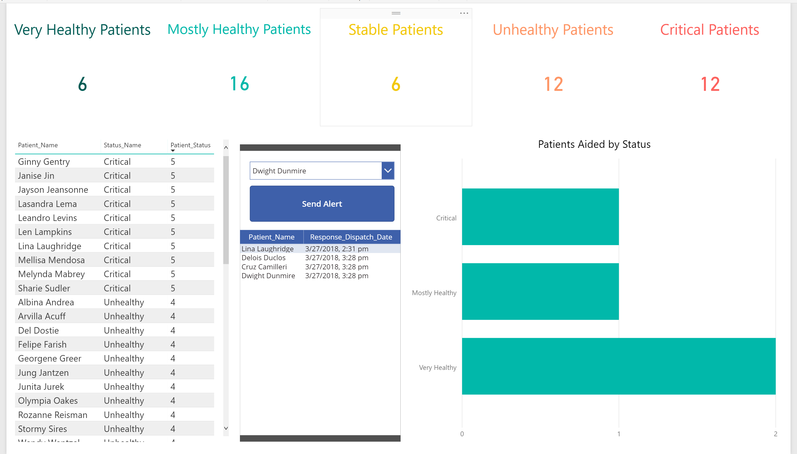

**Notifications with PowerApps**
==

**Scenario**
--
In this tutorial, we will be building a system to allow a hospital to alert nurses to the condition of a patient, as reported by their automated systems. We are also going to create some automatic logging, so that we can audit how we are responding to patient conditions. We will notify the nurses using text messages, via Twilio.

**Setup**
--

Getting set up for this tutorial is pretty easy. If you haven't done the set up listed in the [Manipulating Data with PowerApps](manipulating-data.md) tutorial, head over there before returning here.

We're going to use a different dataset for this app, so you will need to create some new tables and populate them in your database. The script for creating them is [available here](CreateNotificationTables.sql). I will once again be using an Azure SQL Server instance for convenience.

You will also need a [Twilio](https://www.twilio.com/) account. You will need to get a number from them as well. You can get a developer account for free, which is what I've done for this tutorial. Twilio is a service that allows you to send text messages and phone calls from the web.

**Connecting PowerApps to Twilio and SQL Server**
--
Start by creating a new blank app in the phone layout. Once that's all set up, open the Data Source pane and hit the 'Add Source' button, followed by the 'New Connection' button. Select Twilio from that list, and supply the requested information. Your 'Account Id' is the 'Account SID' and your 'Access Token' is the 'Auth Token'.



Once you have provided those details, you will need to add your database to the project. Again, go through to the 'New Connection' menu, and select 'SQL Server'. Fill in the connection details and authentication, selecting either the on-premises gateway or the cloud option depending on how you are set up. Once you are connected to the server, create data sources for the two tables we created during setup (_PatientStatus_ and _PatientResponseDispatches_). You can do this by clicking 'Add data source' and selecting the connection to your SQL Server instance.

**Building the UI**
--
The first thing we are going to do is add a drop down selector. We'll use this for listing the patients we are responsible for monitoring. It can be found under 'Insert'>'Controls'. Once it's down, select it and rename it `PatientSelection`.

Next, add a button. It's on the top bar under 'Insert'. All of our logic will be tied to this button. We'll use it to send out our notification. We'll also link our logging to the button. You should rename the button to `AlertButton`.

Finally, add a data table, also available under 'Insert'. We'll display our logging information here. Rename it to `ResponseTable`.

The next step to finish the UI is to link up our data sources to their UI components. Before we hook things up, it should look like this.



To hook up the dropdown to the list of patients, select it, and go to the 'Advanced' section. In the advanced section, type `'[dbo].[PatientStatus]'` into the 'Data' field. It should offer you a dropdown with the fields of _[dbo].[PatientStatus]_; select Patient_Name from the list and you should see the dropdown populate.

To hook up our logging information, we are going to have to wait until we've written the actual logging. We'll circle back to this once that's done.

**Sending messages**
--
We'll be sending text messages to our nurses using the Twilio connector. It's very simple to use once the connection is established. We are going to tie this to the button we created earlier. Start by selecting the button, and renaming it to something meaningful (in my case, 'Send Alert'). Next, go to the 'Advanced' tab and go to the 'OnSelect' field under 'Action'. This is where we tell the button what to do when it is clicked. Add the following code to the field.

```
Twilio.SendMessage(
    "YOUR-TWILIO-NUMBER-HERE FORMAT: +18005551234"
    , "YOUR-TARGET-NUMBER-HERE FORMAT: +18005554321"
    , Concatenate(
        "Please check in on "
        , PatientSelection.Selected.Patient_Name
        , ", their reported condition is "
        , PatientSelection.Selected.Status_Name
        , ".")
    );
```

This is going to call the Twilio connection you set up earlier to send out a text message from the Twilio number you registered earlier. Start with the command to send a message via Twilio: [Twilio.SendMessage()](https://docs.microsoft.com/en-us/connectors/twilio/#send-text-message-(sms). You should replace the `"YOUR-TWILIO-NUMBER-HERE FORMAT: +18005551234"` with the actual number, i.e. `"+180055551234"`. Same goes for `"YOUR-TARGET-NUMBER-HERE FORMAT: +18005554321"`.

The next argument is the message you want to send. In our case, that's a message about the patients status. We can get the currently selected patient by inspecting the drop down we created earlier. Since we named it `PatientSelection`, we can get its currently selected record by asking for the `Selected` property like so: `PatientSelection.Selected`. This will return the entire record for the selected entry, so we could get access to the patient's name, status, id, or any other information tied to the record. We'll use this to get both the `Patient_Name` and the `Status_Name` to build our message to the nurse.

Once you've added the code, you can go ahead and test it by hitting the 'Play' button in the top right, and clicking the button. If you've set up the message to come to your own phone, you should get a text in the near future with a message about your patient status.

**Adding Logging**
--
Logging when we send out these calls for nurse attention will allow us to offer data around response times and care levels. We are going to do this by writing a record back to the _PatientResponseDispatches_ table whenever we send out a message to a nurse.

Since we want to do this every time we send a message, we will add the code to accomplish this to the end of the code for sending the message. You can put any number of commands in the action of an object, they just have to be separated by a `;`, and will be executed in sequence. Add the following code to the end of the action on your button.

```
Collect(
    '[dbo].[PatientResponseDispatches]'
    , {
        Patient_ID:
            PatientSelection.Selected.Patient_ID
        , Response_Dispatch_Date:
            Now()
    });
```

This will run after the `SendMessage` call, and will add a new record to the _PatientResponseDispatches_ table. [Collect()](https://docs.microsoft.com/en-us/powerapps/maker/canvas-apps/functions/function-clear-collect-clearcollect#collect) is one of the functions you can use to add new records to your data sources. Here we are adding a record to the '[dbo].[PatientResponseDispatches]' data source. The JSON we are passing in as the second argument specifies the values to assign to the fields in _PatientResponseDispatches_. Any field that isn't specified in the JSON will be left as whatever the default value is for that column.

As you can see, we are writing the ID of the patient we sent a message about, and are also logging the time of the message with `Now()`. Since we have left out the primary key field, the identity function on it will populate it as expected.

**Displaying Logging**
--
Now that we know the shape of our logging, it's time to revisit the data table we laid down previously. Start by selecting it, and adding the '[dbo].[PatientResponseDispatches]' data source to it. Select the dispatch time and nothing else. Then, on the 'Advanced' tab, put the following code into the 'Data' field.

```
AddColumns(
    '[dbo].[PatientResponseDispatches]'
    , "Patient_Name"
    , LookUp(
        '[dbo].[PatientStatus]'
        ,Patient_ID = '[dbo].[PatientResponseDispatches]'[@Patient_ID]
    ).Patient_Name)
```
This adds a column to the '[dbo].[PatientResponseDispatches]' data source with the patient's name. We could have added that at the database layer, but this will let us explore some of the extra features available here.

Oncec you've added the code, go back and select the new column from the data source to add it to the table.

**Complete!**
--
You're done! You can now add your notification app to your patient status dashboard. You should end up with something like this.


